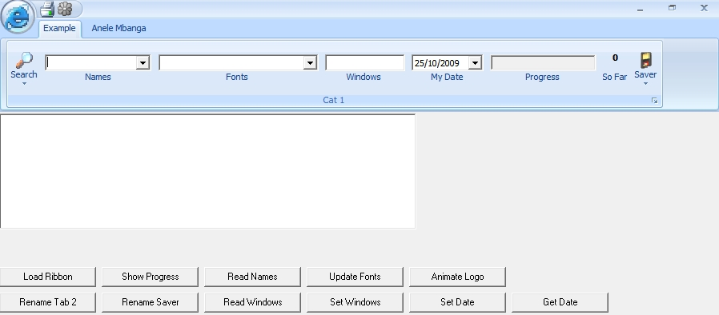



## Office 2007 Ribbon Update

### Description

This is an update of my previous code at http://www.planetsourcecode.com/vb/scripts/ShowCode.asp?txtCodeId=72588&amp;lngWId=1. This version has been updated to have menus on the circle and also on the top buttons. Enjoy and vote if you like.
 
### More Info
 

             |
---                |---
**Submitted On**   |2009-10-25 15:33:18
**By**             |[Anele Mbanga](https://github.com/Planet-Source-Code/PSCIndex/blob/master/ByAuthor/anele-mbanga.md)
**Level**          |Advanced
**User Rating**    |4.4 (40 globes from 9 users)
**Compatibility**  |VB 6\.0
**Category**       |[Custom Controls/ Forms/  Menus](https://github.com/Planet-Source-Code/PSCIndex/blob/master/ByCategory/custom-controls-forms-menus__1-4.md)
**World**          |[Visual Basic](https://github.com/Planet-Source-Code/PSCIndex/blob/master/ByWorld/visual-basic.md)
**Archive File**   |[Office\_20021665210302009\.zip](https://github.com/Planet-Source-Code/anele-mbanga-office-2007-ribbon-update__1-72608/archive/master.zip)

